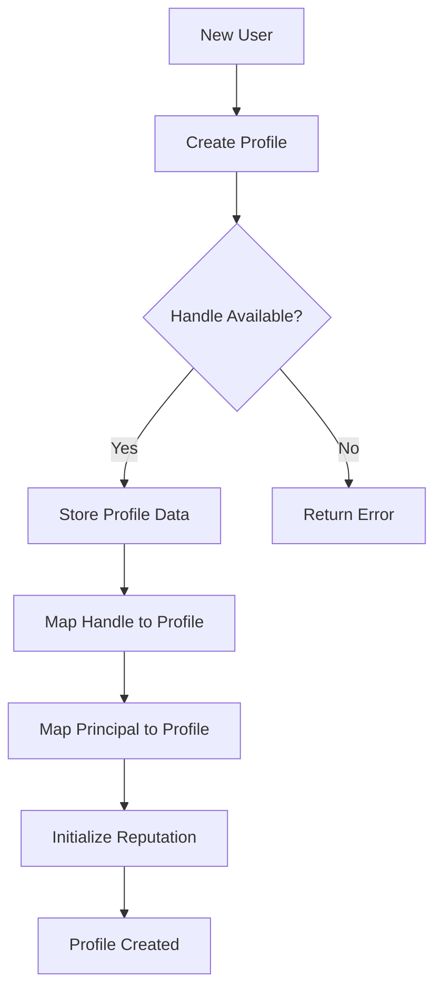
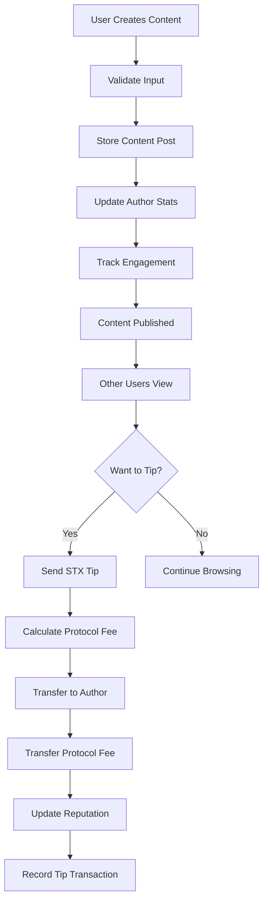
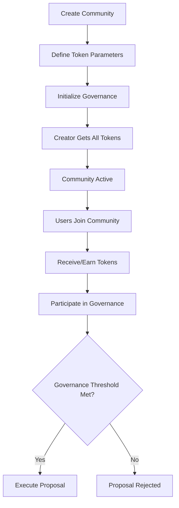

# BitSocial Protocol

## Bitcoin-Native Social Infrastructure for the Decentralized Web

[](https://opensource.org/licenses/MIT)
[](https://stacks.co/)
[](https://bitcoin.org/)

## 🌟 Overview

BitSocial Protocol is a comprehensive decentralized social networking infrastructure built on Stacks Layer 2, enabling censorship-resistant content creation, peer-to-peer value exchange, and community-driven governance with Bitcoin-level security guarantees.

The protocol establishes a foundation for truly decentralized social applications where users maintain complete ownership of their identity, content, and social connections. Through innovative tokenomics and reputation systems, BitSocial creates sustainable incentive structures that reward authentic engagement while preventing spam and manipulation.

## 🏗️ System Architecture

### Core Components

```
┌─────────────────────────────────────────────────────────────┐
│                    BitSocial Protocol                       │
├─────────────────────────────────────────────────────────────┤
│  Identity Layer    │  Content Layer   │  Monetization Layer │
│  • User Profiles   │  • Posts & Media │  • STX Tipping      │
│  • Handle System   │  • Engagement    │  • Protocol Fees    │
│  • Verification    │  • Content Types │  • Value Transfer   │
│  • Reputation      │  • Timestamps    │  • Fee Distribution │
├─────────────────────────────────────────────────────────────┤
│  Social Graph      │  Communities     │  Governance Layer   │
│  • Follow/Unfollow │  • Token Creation│  • Voting Rights    │
│  • Connection Map  │  • Membership    │  • Community Tokens │
│  • Social Metrics  │  • Moderation    │  • Threshold Logic  │
├─────────────────────────────────────────────────────────────┤
│                    Stacks Blockchain                        │
│            Bitcoin-Secured Smart Contracts                  │
└─────────────────────────────────────────────────────────────┘
```

### Contract Architecture

```
BitSocial Contract
├── Constants & Configuration
│   ├── Error Codes (100-112)
│   ├── Protocol Parameters (fees, limits)
│   └── Initial Settings
│
├── State Management
│   ├── Global Counters (profiles, content, communities)
│   ├── Protocol Settings (fee recipient, pause state)
│   └── Administrative Controls
│
├── Data Structures
│   ├── User Profiles (identity, reputation, metrics)
│   ├── Content Posts (text, media, engagement)
│   ├── Social Connections (follower graph)
│   ├── Communities (governance tokens, membership)
│   ├── Tips & Monetization (payments, messages)
│   └── Engagement Tracking (reputation, periods)
│
├── Core Functions
│   ├── Identity Management
│   │   ├── create-profile()
│   │   ├── update-profile()
│   │   └── follow-user()
│   │
│   ├── Content Management
│   │   ├── create-content()
│   │   └── content validation
│   │
│   ├── Monetization
│   │   ├── tip-content()
│   │   ├── fee calculation
│   │   └── value distribution
│   │
│   └── Community Governance
│       ├── create-community()
│       ├── join-community()
│       └── token management
│
└── Query Interface
    ├── Profile Lookups (by ID, handle, principal)
    ├── Content Retrieval
    ├── Social Graph Queries
    ├── Community Information
    └── Protocol Statistics
```

## 🔄 Data Flow

### User Onboarding Flow



### Content Creation & Monetization Flow



### Community Governance Flow



## 🚀 Key Features

### **Sovereign Digital Identity**

- Unique handle system with collision detection
- Cryptographic ownership verification
- Reputation scoring with anti-gaming mechanisms
- Profile verification system

### **Content Monetization**

- Direct STX tipping to content creators
- Protocol fee mechanism (2.5% default)
- Anti-spam measures (minimum tip amounts)
- Message attachments with tips

### **Social Graph Management**

- Decentralized follow/unfollow system
- Bi-directional connection tracking
- Social metrics (follower/following counts)
- Relationship verification queries

### **Community Governance**

- Tokenized community creation
- Membership management
- Governance threshold configuration
- Moderation rights assignment

### **Engagement Tracking**

- Time-based engagement periods
- Multi-dimensional reputation scoring
- Activity-based point systems
- Long-term user incentives

## 🛠️ Technical Specifications

### **Smart Contract Details**

- **Language:** Clarity (Stacks)
- **Security:** Bitcoin-finalized transactions
- **Fee Structure:** 2.5% protocol fee (250 basis points)
- **Minimum Tip:** 1,000 microSTX

### **Data Limits**

- **Handle Length:** 32 characters maximum
- **Bio Length:** 256 UTF-8 characters
- **Content Length:** 1,024 UTF-8 characters
- **URL Length:** 256 characters
- **Message Length:** 256 UTF-8 characters

### **Supported Content Types**

- `text` - Text-based posts
- `image` - Image content with media URLs
- `video` - Video content with media URLs
- `audio` - Audio content with media URLs
- `link` - Link sharing with metadata

## 🔧 Usage Examples

### Creating a Profile

```clarity
(contract-call? .bitsocial create-profile 
  "alice" 
  "Building the future of social media" 
  (some "https://example.com/avatar.jpg"))
```

### Publishing Content

```clarity
(contract-call? .bitsocial create-content 
  "Welcome to decentralized social media!" 
  "text" 
  none 
  none)
```

### Tipping Content

```clarity
(contract-call? .bitsocial tip-content 
  u1 
  u5000 
  (some "Great post!"))
```

### Creating a Community

```clarity
(contract-call? .bitsocial create-community 
  "Bitcoin Builders" 
  "A community for Bitcoin developers" 
  "BTCB" 
  u1000000)
```

## 🛡️ Security Features

### **Access Control**

- Principal-based authentication
- Owner-only administrative functions
- Profile ownership verification
- Community creator privileges

### **Input Validation**

- URL format validation (http/https)
- Content length restrictions
- Handle uniqueness enforcement
- Amount threshold validation

### **Anti-Abuse Mechanisms**

- Self-tipping prevention
- Duplicate tip prevention
- Minimum tip requirements
- Engagement period tracking

### **Emergency Controls**

- Protocol pause functionality
- Fee recipient updates
- Administrative override capabilities
- Verification status management

## 📊 Protocol Economics

### **Revenue Model**

- 2.5% protocol fee on all tips
- Fees collected by protocol treasury
- Sustainable development funding
- Community incentive programs

### **Reputation System**

- Initial reputation: 100 points
- Tip-based reputation increases
- Engagement-weighted scoring
- Long-term user value recognition

### **Token Distribution**

- Community tokens: User-defined supply
- Governance rights: Token-based voting
- Membership benefits: Token-gated features
- Incentive alignment: Creator rewards

## 🔮 Future Roadmap

- **Cross-Chain Integration:** Multi-blockchain support
- **Advanced Governance:** Proposal and voting systems
- **Content Moderation:** Community-driven content policies
- **NFT Integration:** Digital collectibles and media
- **Layer 3 Scaling:** Lightning Network integration
- **Mobile SDK:** Native mobile application support
